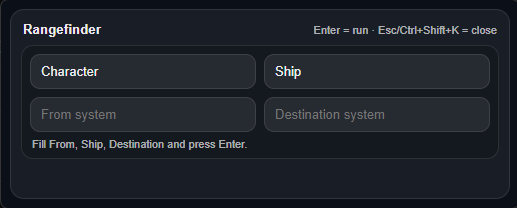
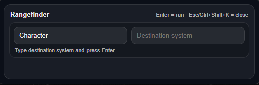
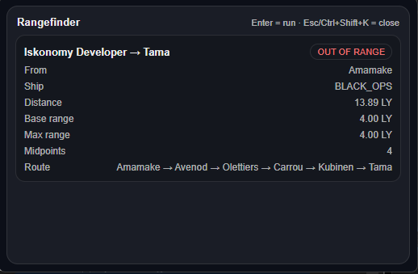

# 🚀 Rangefinder – EVE Online Jump Planner

**Rangefinder** is a lightweight Windows desktop app for pilots who need to find out if they are in range quickly!
It provides **fast, accurate jump range checks** using real in-game data via ESI, with both **automatic** and **manual** planning modes.

Works for all ships capable of using a jump drive, the automatic mode will find what ship and system you are in, what skills you have and tell you if you are currently in range!

---

## ✨ What Rangefinder Does

### 🔹 Instant Jump Checks
- Press a hotkey, type a destination, get an answer
- No browser tabs, no alt-tabbing

### 🔹 Two Planning Modes

**Auto Mode**
- Reads your character’s **current system**
- Detects **ship type**
- Uses your **Jump Drive Calibration skill**
- Instantly shows whether the jump is in range

**Manual Mode**
- Pick any ship class
- Enter start and destination systems
- Still uses your character’s skills
- Perfect for planning routes!

### 🔹 Cyno Routing
- Automatically finds valid cyno chains
- Shows hop-by-hop distances
- Provides a route that will work!

---

## 🖼️ Screenshots

### Auto Mode Popup

### Manual Mode Popup

### Route Results

---

## ⬇️ Download

All releases are built automatically and provided as a **Windows installer**.

👉 **Download the latest version:**  
https://github.com/EggyBoffer/Rangefinder/releases/latest

---

## 🎮 Discord Community

Have feedback, feature requests, or found a bug?

👉 **Join the Discord:**  
https://discord.gg/M87HtnjBYg

---

## 🧠 How It Works

- Secure ESI OAuth character linking
- Live character location, ship, and skill data

---

